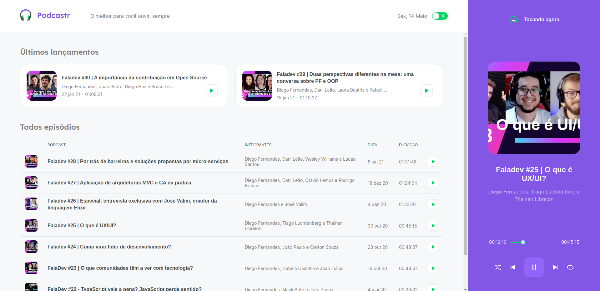

<h1 align="center">
  
</h1>

  

 

 

  

## Technologies

This project was developed using the following technologies:

- [React](https://reactjs.org)
- [Next.js](https://nextjs.org/)
- [TypeScript](https://www.typescriptlang.org/)

## Project

Podcastr is a web application for podcast broadcasting, the project was developed during [Next Level Week](https://nextlevelweek.com/pre-nlw) #05 (ReactJS), event presented by @Rocketseat.

## Layout

You can view the project layout through [this link](https://www.figma.com/file/UwFEntsHpHYJlHNQAQr4gA/Podcastr/duplicate). You must have an account at [Figma](http://figma.com/) to access it.

## How to execute

- Clone the repository `git clone https://github.com/rafaelthz/podcastr-nlw5.git`
- Install the dependencies with `yarn`
- Start the JSON server `yarn server`
- Start the server with `yarn dev`

Now you can access [`localhost:3000`](http://localhost:3000) in your browser.

---

Inspired by @Rocketseat.
